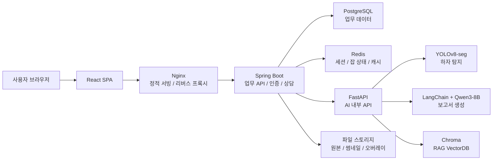
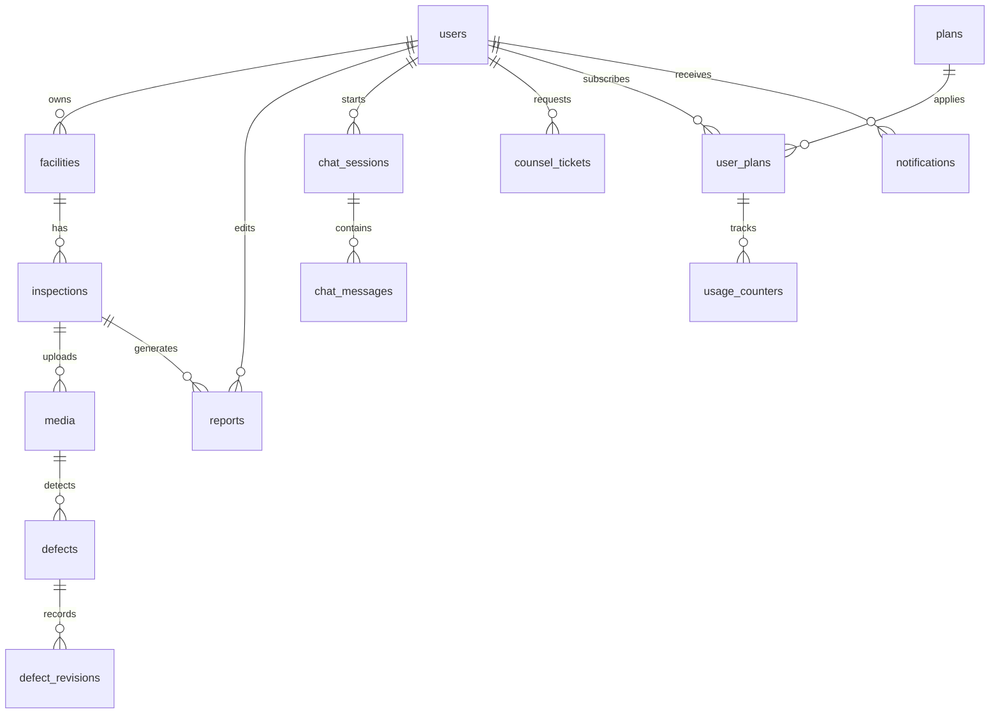

# HajaCheck 착수보고서 슬라이드 가이드 최종 초안

작성 기준: `PRD_hajaCheck_v0.41.md`, `hajaCheck_착수보고_역할분담.md`, `hajaCheck_착수보고_슬라이드_가이드.md`, `AI_개발_컨벤션.md`, `React_코드_컨벤션.md`, `SpringBoot_코드_컨벤션.md`, `example/1.png`~`example/8.png`

## 전체 방향

- 최종 분량은 기존 템플릿 8장에 신규 설계 산출물 4장을 추가해 총 12장으로 구성한다.
- 기존 템플릿의 톤은 유지한다: 밝은 회색 배경, 흰색 라운드 패널, 파란색 강조, 큰 장 번호, 짧은 문장 중심.
- 발표 흐름은 `왜 필요한가 -> 누구에게 무엇을 제공하는가 -> 어떻게 만들 것인가 -> 무엇으로 검증할 것인가` 순서로 잡는다.
- 본문은 장표당 핵심 문장 1개와 보조 정보 3~5개만 남긴다. 상세 표와 긴 요구사항은 신규 설계 슬라이드 또는 부록으로 분리한다.
- 발표자는 PRD를 그대로 읽기보다, 각 슬라이드의 상단 메시지를 먼저 말하고 세부 항목을 설명한다.

## 최종 목차

1. 표지
2. 목차
3. 프로젝트 소개
4. 서비스 전략
5. 수행 계획
6. 개발 환경 및 아키텍처
7. 서비스 설계
8. 검증 및 마무리
9. 시스템 아키텍처 구조도
10. IA 및 핵심 화면 흐름
11. ERD 요약
12. API 명세 요약

---

## 슬라이드 1. 표지

목적: 프로젝트명과 주제를 첫 화면에서 명확히 인식시키는 표지.

권장 레이아웃: `example/1.png` 유지. 넓은 여백, 좌측 대형 프로젝트명, 우측 상단 HajaCheck 워드마크.

삽입 문구:

```text
AI 기반 시설물 외관 하자 점검 플랫폼

HajaCheck

착수보고서

2026.07.14

PM 김승현 | 팀원 김관영·오영석·이은석·허남·유병현·정재봉·황승현
```

디자인 메모:

- `HajaCheck`는 가장 크게, 부제는 한 줄로 짧게 둔다.
- 팀원명은 하단 가는 선 위 또는 아래에 작게 배치한다.
- 로고 이미지를 사용할 경우 우측 상단 워드마크와 중복되지 않게 하나만 남긴다.

출처: PRD 문서 상단 메타 정보, 팀 구성.

---

## 슬라이드 2. 목차

목적: 6장 구조를 한눈에 보여주고, 착수보고의 논리 흐름을 안내한다.

권장 레이아웃: `example/2.png` 유지. 6개 챕터 카드형 목차.

삽입 문구:

```text
01 프로젝트 소개
팀 소개 / 프로젝트 개요
추진 배경 및 목표 / 기대 효과

02 서비스 전략
타겟층 분석 및 MVP 범위
벤치마킹 및 핵심 차별점

03 수행 계획
역할 분담 및 협업 프로세스
일정 계획 및 리스크 대응

04 개발 환경 및 아키텍처
기술 스택 및 개발 환경
시스템 아키텍처 / AI 처리 흐름

05 서비스 설계
요구사항·기능·정책 정의서 / 메뉴 구조도
업무 흐름도·화면 설계·API·ERD

06 검증 및 마무리
KPI 및 테스트 검증 계획
최종 산출물 / 오픈 이슈
```

디자인 메모:

- 영문 `CONTENTS`는 유지해도 무방하나, 발표 톤을 맞추려면 `목차`로 바꾼다.
- 01~06 번호는 파란색, 챕터명은 검정 굵은 글씨, 소목차는 회색 작은 글씨로 통일한다.

출처: 역할분담 문서의 확정 목차.

---

## 슬라이드 3. 프로젝트 소개

목적: 팀 소개, 문제 정의, 솔루션, 프로젝트 목표를 한 장에서 설득한다.

권장 레이아웃: `example/3.png` 변형. 좌측은 기존 점검 방식의 문제, 우측은 HajaCheck의 핵심 수치와 목표.

상단 메시지:

```text
고위험·고비용의 육안 점검을 AI 탐지와 보고서 자동화로 보조합니다
```

삽입 문구:

```text
팀 소개
- 팀명: HajaCheck
- 구성: PM/PL 포함 8명
- 한줄소개: 시설물 점검 업무를 AI로 보조하는 풀스택 개발팀

문제 배경
- 고층 외벽·교량 하부 등은 직접 점검 시 추락 위험과 장시간 소요가 큼
- 점검자 숙련도에 따라 판독 편차가 발생
- 점검 이력이 체계적으로 축적되지 않아 변화 추적이 어려움

솔루션 요약
- 이미지·영상 업로드
- AI 하자 자동 탐지·분류·심각도 평가
- 오버레이 기반 검수
- LLM 보고서 초안 생성
- RAG 기반 점검 기준 Q&A

프로젝트 목표
- 4주 내 E2E 데모 완성
- mAP@0.5 0.7 이상
- 이미지 100장 기준 보고서 초안 10분 이내

기대 효과
- 판독 시간 단축과 하자 누락 감소
- 점검 이력 축적을 통한 시설물 상태 추적
- 보고서 작성 부담 완화
```

디자인 메모:

- 좌측 차트 영역은 `기존 점검 -> HajaCheck` 비교 그래픽으로 쓰면 좋다.
- 우측 스탯 카드 4개는 `8명`, `4주`, `mAP 0.7+`, `100장 10분`으로 배치한다. `8명` 카드 아래에는 `PM/PL/메뉴 오너/기술 챕터`를 작게 넣어 팀 존재감을 보강한다.
- 하단 작은 말풍선에는 `업로드 -> 탐지 -> 검수 -> 보고서` 흐름을 넣는다.

출처: PRD 문서 상단 메타, PRD 1.1, 1.2, 2.1, 9.

---

## 슬라이드 4. 서비스 전략

목적: 누구를 위해 어떤 MVP를 만들고, 기존 서비스 대비 어떤 차별점이 있는지 정리한다.

권장 레이아웃: `example/4.png` 유지. 3열 비교 카드.

상단 메시지:

```text
점검 업무의 핵심 흐름을 MVP로 묶고, AI 탐지·보고서·상담을 하나의 플랫폼에서 제공합니다
```

3열 카드 삽입 문구:

```text
타겟층 분석
안전점검 기술자
- 판독 시간 단축
- 누락 방지

시설물 관리자
- 상태 한눈에 파악
- 점검 이력 관리

점검 책임자
- 법규 기준 보고서 작성
- 결재·제출 시간 단축

서비스 관리자
- 사용자·콘텐츠·상담 운영
```

```text
MVP 범위
업로드
-> AI 탐지
-> 시각화·검수
-> LLM 보고서
-> RAG Q&A
-> 상담원 연결

P0 핵심
- 소셜 로그인
- 시설물·점검 관리
- 이미지·영상 업로드
- 균열 중심 하자 탐지
- PDF 보고서 내보내기
- 관리자 페이지
```

```text
USE CASES
안전점검 기술자
- 업로드 -> 탐지 -> 검수로 판독 시간을 줄임

시설물 관리자
- 시설물별 점검 이력과 하자 상태를 확인

점검 책임자
- 확정 하자 목록으로 보고서 초안을 생성하고 PDF로 제출

서비스 관리자
- 사용자, 하자 기준, 상담, RAG 문서를 운영
```

```text
벤치마킹 및 차별점
참고 서비스
- VODA
- Inspekt AI
- Hammer Missions
- FMS

핵심 차별점
- AI 탐지 + LLM 보고서 + RAG 상담 통합
- 점검 회차와 하자 이력 중심 관리
- 휴먼 검수 기반 오탐 보정
- 멤버십 쿼터 기반 B2B 확장 가능
```

디자인 메모:

- 카드 제목은 `타겟층 분석`, `MVP 범위`, `벤치마킹 및 차별점` 3개만 크게 둔다.
- 가운데 MVP 카드는 선형 흐름을 아이콘 또는 화살표로 표현한다. 공간이 부족하면 `USE CASES`는 카드 하단 얇은 띠 영역에 4개 역할별 한 줄 시나리오로 넣는다.
- 벤치마킹은 서비스명을 많이 나열하기보다 공통 패턴과 차별점에 집중한다.

발표 메모:

- 이 장은 유병현 담당 슬라이드의 핵심이다.
- “우리 서비스는 단순 탐지기가 아니라 점검 업무 흐름 전체를 묶는 플랫폼”이라는 문장을 먼저 말하면 좋다.
- 원본 목차의 `USE CASES(페르소나)` 항목은 이 슬라이드에서 흡수한다. 발표 시 4개 페르소나별 사용 흐름을 짧게 짚는다.

출처: PRD 2.2, 2.3, 2.4, 3.

---

## 슬라이드 5. 수행 계획

목적: 팀이 4주 안에 완성하기 위해 어떤 방식으로 일할지 보여준다.

권장 레이아웃: `example/5.png` 유지. 좌측 이미지, 우측 큰 메시지와 3개 불릿.

상단 제목:

```text
03 수행 계획
```

본문 타이틀:

```text
메뉴 단위 오너십
+ 풀스택 챕터제
```

삽입 문구:

```text
메뉴 오너가 화면·서버·AI 연동까지 직접 구현하고,
기술 챕터 오너는 표준과 리뷰로 교차 지원합니다.

- 전원이 React·Spring Boot·AI 연동을 직접 경험
- PR 리뷰 필수 + 주 1회 팀 코드 리뷰
- 핵심 리스크는 Contract-First와 워킹 스켈레톤으로 조기 대응
```

하단 또는 보조 영역 문구:

```text
협업 도구: Jira / Slack / GitHub

주요 일정
7.9~7.13 착수보고 초안
7.14 착수보고 발표
7.15~7.19 스프린트 1 / AI 온보딩 / 코드 리뷰 1
7.21~7.29 스프린트 2 / 코드 리뷰 2·3
7.31 중간보고
8.3~8.6 사용자 테스트 및 개선
8.7 완료보고
```

역할 분담 보조 문구:

```text
메뉴 오너 예시
- 유병현: 하자 관리 + 통계(P1), 자연어 검색, 데이터(DB·API 계약)
- 김관영: 랜딩 + 보고서 + 지도 뷰, 화면설계/IA 산출물

기술 챕터 예시
- 데이터: ERD, 마이그레이션, API 계약, Redis 키 규약
- DevOps: OCI, Nginx, PostgreSQL/Redis, CI/CD
```

디자인 메모:

- 좌측 이미지는 템플릿의 벽돌 이미지를 유지해도 되지만, 가능하면 팀 협업 또는 시스템 설계 이미지를 사용한다.
- 우측 본문은 3줄 이상 길어지면 가독성이 급격히 떨어지므로, 세부 역할표는 작은 보조 박스 또는 발표 말로 보충한다.
- 일정은 전체 표를 넣기보다 7개 마일스톤을 가로 타임라인으로 압축한다.

출처: PRD 7, 8, 10. 역할분담 문서.

---

## 슬라이드 6. 개발 환경 및 아키텍처

목적: 기술 스택을 한눈에 보여주고, 시스템이 어떤 레이어로 구성되는지 예고한다.

권장 레이아웃: `example/6.png` 변형. 키워드 그리드.

상단 제목:

```text
04 개발 환경 및 아키텍처
```

상단 메시지:

```text
React·Spring Boot·FastAPI를 중심으로 탐지, 생성, 검색 기능을 분리해 구현합니다
```

키워드 삽입 문구:

```text
React 18 + Vite
Spring Boot 3.x
JDK 17
FastAPI
PostgreSQL
Redis
YOLOv8-seg
ONNX Runtime
LangChain
Qwen3-8B
Chroma
OCI Ampere A1
Nginx
GitHub Actions
```

하단 보조 문구:

```text
Frontend: React SPA
Backend: Spring Boot 모듈러 모놀리스
AI Server: FastAPI 기반 탐지·LLM·RAG
Infra: OCI VM + Nginx + systemd + GitHub Actions
```

디자인 메모:

- 기존 `급상승 미디어 키워드` 라벨은 `핵심 기술 스택`으로 교체한다.
- 기술명이 많으므로 파란색 강조 박스는 핵심 4개만 둔다: `React`, `Spring Boot`, `FastAPI`, `YOLOv8-seg`.
- 세부 아키텍처는 9번 슬라이드에서 다루므로 이 장에서는 키워드만 보여준다.

출처: PRD 6, 6.1, 6.2. React/Spring/AI 컨벤션 문서.

---

## 슬라이드 7. 서비스 설계

목적: 5장 설계 산출물의 “입구” 역할. 상세 산출물은 뒤 9~12번으로 분리한다.

권장 레이아웃: `example/7.png` 유지. 5개 카드형 설계 산출물.

상단 제목:

```text
05 서비스 설계
```

카드 삽입 문구:

```text
요구사항 정의
P0/P1/P2 범위와 사용자 역할 기준 정리

기능 정의
FR-1~FR-9 핵심 기능과 처리 흐름 정의

정책 정의
권한, 플랜 쿼터, 심각도 등급, 상태머신 기준

IA·화면 설계
메뉴 구조와 핵심 화면 흐름 정리

API·ERD 설계
Contract-First 기반 API 계약과 데이터 모델 정의
```

디자인 메모:

- 기존 5개 카드 구조와 아이콘을 그대로 활용한다.
- 문장보다 명사형 라벨 위주로 구성한다.
- 9~12번 신규 슬라이드로 이어지는 브릿지 역할이므로, 이 장에서 ERD나 API 표를 넣지 않는다.

출처: PRD 4, 5, 6.3. SpringBoot/React/AI 컨벤션 문서.

---

## 슬라이드 8. 검증 및 마무리

목적: 성공 기준, 제출 산출물, 남은 의사결정 사항을 명확히 정리한다.

권장 레이아웃: `example/8.png` 유지. 좌측 벤다이어그램, 우측 번호 리스트.

좌측 벤다이어그램 문구:

```text
KPI
mAP / 처리시간 / E2E

최종 산출물
PRD / 화면 / API / ERD

오픈 이슈
클래스 / 예산 / 등급
```

우측 번호 리스트 삽입 문구:

```text
1. KPI 목표 달성 전략
탐지 성능 mAP@0.5 0.7 이상, 이미지 100장 기준 10분 이내, E2E 시연 무결점 완주, 챗봇 출처 표기율 100%를 검증 기준으로 둡니다.

2. 최종 산출물 체크리스트
PRD, 요구사항·기능·정책 정의서, 화면설계서, IA 트리, ERD, API 명세, 코드 컨벤션 문서를 단계별로 제출합니다.

3. 핵심 리스크 대응
학습 데이터 부족은 공개 데이터셋과 클래스 축소로 대응하고, Spring-FastAPI 연동 지연은 Contract-First와 워킹 스켈레톤으로 조기 검증합니다.

4. 오픈 이슈 및 Q&A
탐지 클래스, HF 계정·예산, 심각도 등급, 상담원 역할, 챗봇 시나리오를 1차 멘토링 전 확정하고 마지막은 Q&A로 마무리합니다.
```

리스크 보조 문구:

```text
주요 리스크 3개
- 데이터 부족·품질: AI Hub 공개 데이터셋, 균열 중심 클래스 축소
- 연동 지연: OpenAPI 선작성, MSW 목서버, Swagger diff 리뷰
- sLLM 품질·비용: 템플릿 조립, Grounding Check, HF 예산 가드레일
```

디자인 메모:

- 우측 리스트는 한 항목당 2줄을 넘기지 않는다.
- 벤다이어그램은 개념만 보여주고, 상세 KPI는 발표자가 보충한다.
- Q&A는 별도 장으로 빼지 않고 우측 4번 항목 또는 슬라이드 하단에 `Q&A` 라벨로 명시한다.

출처: PRD 8, 9, 10, 11.

---

## 슬라이드 9. 시스템 아키텍처 구조도

목적: 서비스의 런타임 구조와 주요 통신 흐름을 시각화한다.

권장 레이아웃: 신규 슬라이드. `example/7.png`의 카드 톤을 유지하되, 중앙에 구조도를 크게 배치한다.

상단 메시지:

```text
Spring Boot는 업무 API를 담당하고, FastAPI는 AI 탐지·보고서·RAG 처리를 담당합니다
```

구조도에 넣을 내용:

```text
사용자 브라우저
-> React SPA
-> Nginx
-> Spring Boot
-> PostgreSQL / Redis
-> FastAPI
-> YOLOv8-seg / LangChain / Qwen3-8B / Chroma
-> 파일 스토리지
```

Mermaid 초안:



하단 보조 문구:

```text
분석 요청은 비동기 잡 패턴으로 처리하고, 진행률은 Redis에 저장해 프론트에서 폴링합니다.
FastAPI, PostgreSQL, Redis, Chroma는 외부 포트를 열지 않고 내부 통신 중심으로 구성합니다.
```

디자인 메모:

- 선은 5~7개 정도로 단순화한다. 너무 세부적인 보안/포트 정보는 발표자가 설명한다.
- `Spring Boot`, `FastAPI`, `PostgreSQL`, `Redis`를 서로 다른 색 또는 아이콘으로 구분한다.

출처: PRD 6, 6.1.

---

## 슬라이드 10. IA 및 핵심 화면 흐름

목적: 사용자가 실제로 서비스를 어떻게 이동하고 사용하는지, 핵심 화면설계가 어떤 방향인지 보여준다.

권장 레이아웃: 신규 슬라이드. 좌측 IA 트리, 우측 핵심 업무 흐름.

상단 메시지:

```text
시설물 단위 관리에서 점검 회차, 하자 검수, 보고서 생성까지 하나의 흐름으로 연결합니다
```

좌측 IA 삽입 문구:

```text
랜딩
로그인/회원가입
대시보드
시설물 관리
점검 관리
하자 관리
보고서
고객지원
마이페이지
관리자 페이지
```

우측 핵심 화면 흐름:

```text
시설물 등록
-> 점검 회차 생성
-> 이미지·영상 업로드
-> AI 분석 실행
-> 결과 뷰어 확인
-> 오탐 수정·등급 조정
-> 보고서 생성
-> PDF 내보내기
-> RAG Q&A / 상담원 연결
```

강조 화면 3종:

```text
1. 분석 결과 뷰어
원본 이미지 위에 하자 오버레이, 필터, 확대, 수동 검수 제공

2. 하자 관리
하자 목록·상세, 상태머신, 자연어 검색, 회차 비교

3. 보고서
확정 하자 목록 기반 LLM 초안 생성, 편집, PDF 출력
```

화면설계 목업에 들어갈 요소:

```text
분석 결과 뷰어
- 좌측 원본/오버레이 이미지
- 우측 하자 목록, confidence, 심각도, 검수 상태
- 상단 필터: 하자 유형, 등급, 검수 여부

하자 관리
- 하자 목록 테이블
- 상태 필터: 신규, 검수확정, 조치대기, 조치중, 조치완료
- 자연어 검색 입력창

보고서
- 점검 개요, 하자 현황 요약표, 유형별 상세, 조치 권고
- 생성, 편집, PDF 내보내기 버튼
```

디자인 메모:

- IA 전체를 너무 깊게 펼치지 말고 1depth 메뉴만 둔다.
- P1 항목은 작은 배지로 표시한다: 알림 센터, 통계, 지도 뷰, 멤버십 쿼터.
- 유병현 담당 범위인 `하자 관리 + 통계(P1)`, `데이터/API 계약`과 연결되는 부분은 발표 시 강조한다.
- 원본 목차의 `화면 설계서` 항목은 이 슬라이드에서 목업 방향으로 보강하고, 실제 상세 목업은 별도 산출물로 분리한다.

출처: PRD 4, 5, 7.

---

## 슬라이드 11. ERD 요약

목적: 데이터 모델의 중심 엔티티와 관계를 설명한다.

권장 레이아웃: 신규 슬라이드. 중앙 ERD, 우측에 설계 원칙 3개.

상단 메시지:

```text
시설물, 점검, 미디어, 하자, 보고서를 중심으로 점검 이력과 검수 이력을 축적합니다
```

핵심 엔티티:

```text
users
facilities
inspections
media
defects
defect_revisions
reports
chat_sessions
chat_messages
counsel_tickets
rag_documents
plans
user_plans
usage_counters
notifications
```

Mermaid 초안:



우측 설계 원칙:

```text
1. 하자 검수 이력은 append-only로 보존
2. RAG 답변은 출처 citation 필드 필수
3. 역할 권한과 플랜 쿼터는 분리 관리
```

디자인 메모:

- 모든 컬럼을 넣지 말고 엔티티명과 관계만 보여준다.
- `defect_revisions`, `usage_counters`, `chat_messages.citation`은 v0.41의 설계 보강 포인트이므로 강조한다.
- 실제 물리 ERD는 별도 상세 산출물로 제출하고, 발표 장표는 요약 ERD로 충분하다.

출처: PRD 6.3, FR-1, FR-4, FR-6, 2.4.

---

## 슬라이드 12. API 명세 요약

목적: 프론트, 백엔드, AI 서버가 어떤 계약으로 병렬 개발되는지 보여준다.

권장 레이아웃: 신규 슬라이드. 좌측 핵심 REST API 표, 우측 AI/FastAPI 계약 요약.

상단 메시지:

```text
Contract-First 방식으로 API 계약을 먼저 맞추고, 프론트와 백엔드를 병렬 개발합니다
```

좌측 REST API 표:

```text
Auth
POST /api/auth/oauth/{provider}
GET /api/users/me

Facility
GET /api/facilities
POST /api/facilities
GET /api/facilities/{id}

Inspection
POST /api/inspections
POST /api/inspections/{id}/media
POST /api/inspections/{id}/analysis
GET /api/analysis-jobs/{jobId}

Defect
GET /api/defects
GET /api/defects/{id}
PATCH /api/defects/{id}/status
PATCH /api/defects/{id}/review

Report
POST /api/reports
GET /api/reports/{id}
GET /api/reports/{id}/pdf

Support
POST /api/support/chat
POST /api/counsel/tickets
WS /ws
```

우측 AI API 표:

```text
POST /ai/detect
하자 탐지 요청, jobId 또는 탐지 결과 반환

POST /ai/report
확정 하자 목록 기반 보고서 섹션 생성

POST /ai/chat
점검 기준·법규 RAG Q&A

POST /ai/defect-explain
선택 하자의 원인·위험·조치 설명

POST /ai/nl-search
자연어 질의를 하자 필터 조건으로 변환
```

공통 응답 규약:

```json
{
  "success": true,
  "data": {},
  "error": null
}
```

하단 보조 문구:

```text
OpenAPI 스펙 우선 작성 -> 프론트 MSW 목서버 병렬 개발 -> Swagger diff 리뷰로 계약 변경 관리
```

디자인 메모:

- API는 모두 넣지 말고 시연 흐름에 필요한 핵심만 넣는다.
- `POST /api/inspections/{id}/analysis`, `GET /api/analysis-jobs/{jobId}`, `/ai/report`, `/ai/chat`, `/ai/nl-search`를 강조한다.
- 표가 길면 2열로 나누고, 메서드는 작은 배지 형태로 표시한다.

출처: PRD 5, 6.2, 8, 10. SpringBoot/AI/React 컨벤션 문서.

---

## 담당자별 작업 정리

김관영 담당:

- 슬라이드 1 표지
- 슬라이드 2 목차
- 슬라이드 3 프로젝트 소개
- 슬라이드 5 수행 계획
- 슬라이드 8 검증 및 마무리
- 슬라이드 10 IA 및 핵심 화면 흐름

유병현 담당:

- 슬라이드 4 서비스 전략
- 슬라이드 6 개발 환경 및 아키텍처
- 슬라이드 7 서비스 설계
- 슬라이드 9 시스템 아키텍처 구조도
- 슬라이드 11 ERD 요약
- 슬라이드 12 API 명세 요약

## 제작 우선순위

1. 먼저 기존 8장 템플릿의 문구를 모두 교체한다.
2. 그 다음 9번 시스템 아키텍처와 10번 IA 흐름을 만든다.
3. 시간이 부족하면 11번 ERD와 12번 API는 요약 수준으로 만들고, 상세 산출물은 별도 문서로 제출한다.
4. 발표 전 마지막 점검은 `업로드 -> 탐지 -> 검수 -> 보고서 -> 챗봇 -> 상담` 흐름이 모든 장에서 일관되게 보이는지 확인한다.

## 발표 한 줄 요약

```text
HajaCheck는 시설물 점검 이미지를 업로드하면 AI가 하자를 탐지하고, 사람이 검수한 결과를 바탕으로 보고서와 점검 기준 상담까지 지원하는 AI 기반 점검 보조 플랫폼입니다.
```
